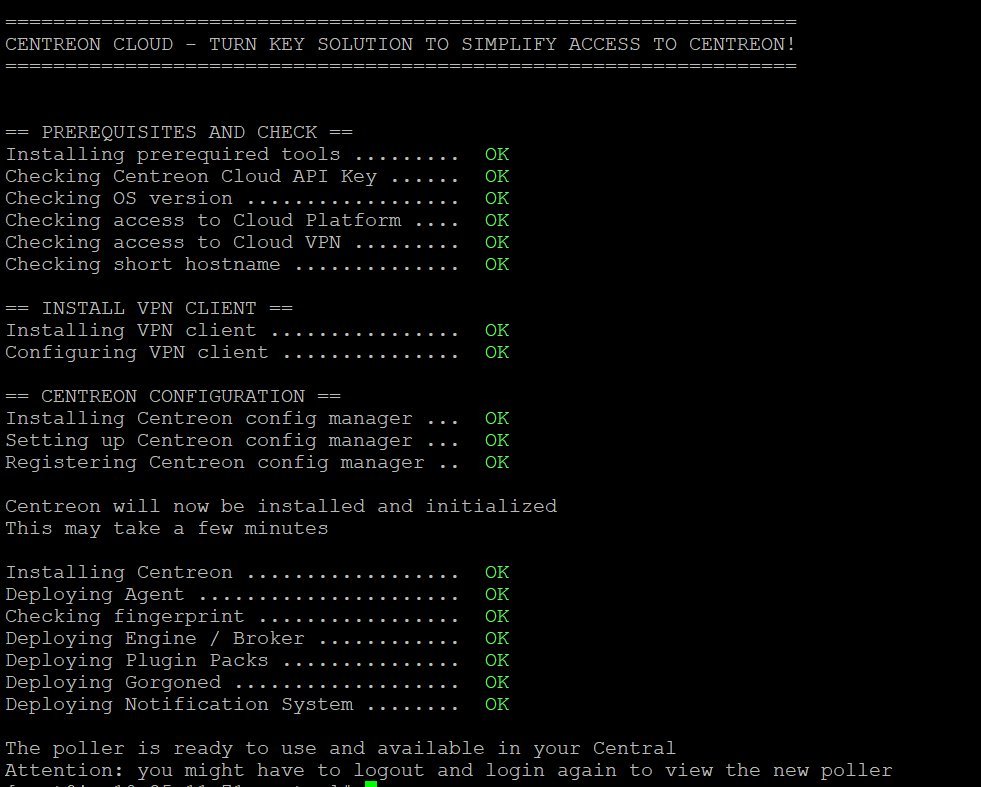

With Centreon Cloud, your central server is already ready to use. All you have to do is to install pollers in your infrastructure, and that is very easy to do: just execute a script and there you are.

Before deploying a poller, make sure the [prerequisites](../cloud-prerequisites) for your host machine are met.

## Step 1: Running the script

1. Use SSH to connect to the server that will become a poller. 

2. Run the command that will deploy the poller automatically. This command has been provided to you by our support team. It looks like this:

  ```shell
  bash -c "$(curl -H "content-type: application/json"  -H "x-api-key: <your_token>"  https://api.euwest1.prod1.centreon.cloud/v1/organization/<your_organization_code>/site/centreon/poller -s)"
  ```

  Example: 
  
  ```shell
  bash -c "$(curl -H "content-type: application/json"  -H "x-api-key: prod.centreon-qa.f39d2fff-b3a2-4f17-b49a-42a3671f6e42"  https://api.euwest1.prod1.centreon.cloud/v1/organization/centreon-qa/site/centreon/poller -s)"
  ```

  The script is executed (this should take about 10 minutes):

  

3. When this is finished, log in to your central server and go to page **Configuration > Pollers > Pollers**. The new poller appears in the list of pollers.
   * By default, the name of the poller is its hostname (this may be shortened). Click on its name to rename it.
   * In the **IP Address** column, the address it that of the poller as seen by the central. Indeed, during the installation process, a VPN is installed, so this IP address is that of the poller inside the VPN.
   * The poller is not running yet (**No** in the ... column).

## Step 2: Exporting the configuration and restarting the poller

Export the configuration for this poller: 
1. Go to **Configuration > Pollers > Pollers**, then select the poller you have just created. 
2. Click **Export configuration**:
   * Check the 4 first boxes
   * Under **Restart Scheduler**, select Méthode RESTART
3. Click **Export**. A log of the export is displayed: this should have no errors.
4. Go back to **Configuration > Pollers > Pollers**: en cours d'exécution? should say **Yes**. Your poller is now ready to monitor resources.
