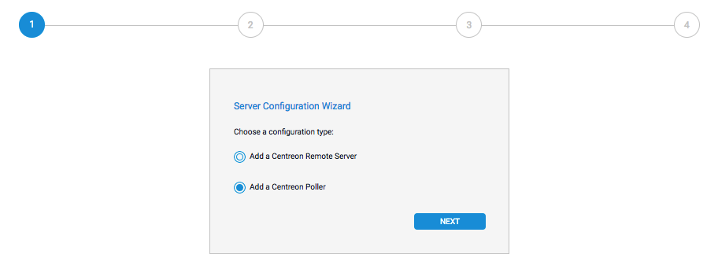
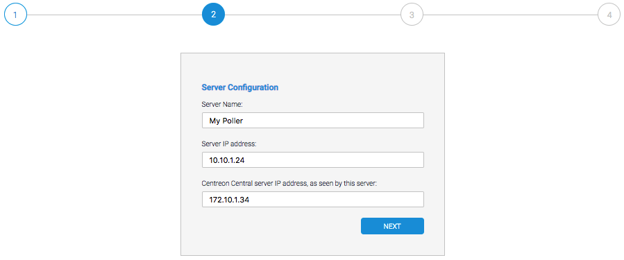
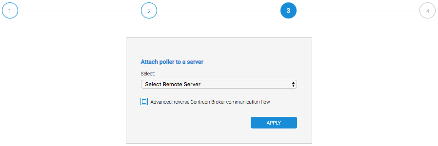
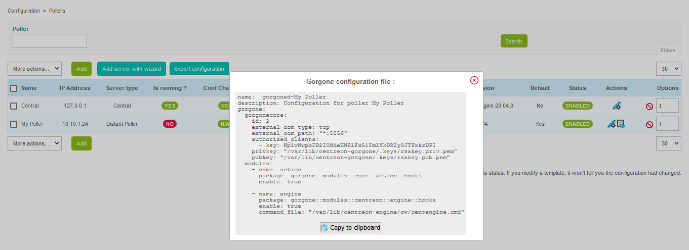

## Configurer un nouveau Poller

Depuis la version 18.10, un nouvel assistant de configuration permet de créer
toutes les configurations nécessaire pour ajouter un Poller.

> Vous pouvez toujours ajouter un nouveau Poller manuellement mais la procédure
> suivante est recommandée.

Rendez-vous dans le menu **Configuration > Pollers > Pollers** et cliquez sur
**Add server with wizard** pour accéder à l'assistant de configuration.

Sélectionnez **Add a Centreon Poller** et cliquez sur **Next** :



Saisissez le nom, l'adresse IP du collecteur et celle du serveur Centreon Central,
cliquez sur **Next** :



> L'adresse IP du collecteur est l'adresse IP ou le FQNS pour accéder au collecteur depuis le serveur Centreon Central.
>
> L'adresse IP du collecteur est l'adresse IP ou le FQNS pour accéder au collecteur serveur Centreon Central vers le collecteur.

Si vous souhaitez lier ce collecteur au serveur Centreon Central, cliquez sur **Apply** :



Sinon, si vous souhaitez lier ce collecteur à un Remote Server, sélectionnez le Remote Server dans la liste et cliquez
sur **Apply** :

Patientez quelques secondes, l'assistant va configurer votre nouveau serveur.


## Activer la communication

La communication entre un Central et un Poller est assurée par Gorgone et peut
être faite en utilisant ZMQ (avec un Gorgone s'exécutant sur le Poller,
recommandé) ou en utilisant le protocole SSH.

<!--DOCUSAURUS_CODE_TABS-->
<!--Avec ZMQ (Recommandé)-->
#### Sélectionner le type de communication

Editer la configuration du Poller fraichement créé, et sélectionner **ZMQ**
comme **Gorgone connection protocol**. Définir le **port** adéquat (le port
**5556** est recommandé).


Cliquer sur **Save**.

#### Afficher la configuration de Gorgone

Depuis la liste des Pollers, cliquer sur l'icon d'action **Gorgone
configuration**.

Une popin affiche la configuration à copier dans le terminal du Poller. Cliquer
sur **Copy to clipboard**.



Copier directement dans le terminal car le contenu suivant est dans le
presse-papier et créera le fichier de configuration attendu :

```shell
cat <<EOF > /etc/centreon-gorgone/config.d/40-gorgoned.yaml
name:  gorgoned-My Poller
description: Configuration for poller My Poller
gorgone:
  gorgonecore:
    id: 2
    external_com_type: tcp
    external_com_path: "*:5556"
    authorized_clients:
      - key: Np1wWwpbFD2I0MdeHWRlFx51FmlYkDRZy9JTFxkrDPI
    privkey: "/var/lib/centreon-gorgone/.keys/rsakey.priv.pem"
    pubkey: "/var/lib/centreon-gorgone/.keys/rsakey.pub.pem"
  modules:
    - name: action
      package: gorgone::modules::core::action::hooks
      enable: true

    - name: engine
      package: gorgone::modules::centreon::engine::hooks
      enable: true
      command_file: "/var/lib/centreon-engine/rw/centengine.cmd"

EOF
```

> Vous pouvez copier la configuration en sélectionnant le contenu de la popin
> pour la copier dans un fichier de configuration personnalisé.

#### Démarrer le daemon Gorgone

Depuis le Poller, exécuter la commande suivante :

```shell
systemctl start gorgoned
```

Assurez vous que le service est démarrer en exécutant la commande suivante :

```shell
systemctl status gorgoned
```

Le résultat devrait être similaire :

```shell
● gorgoned.service - Centreon Gorgone
   Loaded: loaded (/etc/systemd/system/gorgoned.service; disabled; vendor preset: disabled)
   Active: active (running) since Mon 2020-03-24 19:45:00 CET; 20h ago
 Main PID: 28583 (perl)
   CGroup: /system.slice/gorgoned.service
           ├─28583 /usr/bin/perl /usr/bin/gorgoned --config=/etc/centreon-gorgone/config.yaml --logfile=/var/log/centreon-gorgone/gorgoned.log --severity=info
           ├─28596 gorgone-dbcleaner
           ├─28597 gorgone-engine
           └─28598 gorgone-action

Mar 24 19:45:00 localhost.localdomain systemd[1]: Started Centreon Gorgone.
```
<!--Avec SSH-->
#### Sélectionner le type de communication

Editer la configuration du Poller fraichement créé, et sélectionner **SSH**
comme **Gorgone connection protocol**. Définir le **port** adéquat.


Cliquer sur **Save**.

## Echange de clés SSH

Si vous n’avez pas de clé SSH privée sur le serveur Central pour l’utilisateur **centreon-gorgone** :

``` shell
su - centreon-gorgone
ssh-keygen -t rsa
```

> Appuyez sur la touche *entrée* quand il vous sera demandé de saisir un fichier pour enregistrer la clé. **Laissez le
> mot de passe vide**. Vous recevrez une empreinte digitale de clé et une image randomart.

Générez un mot de passe sur le nouveau serveur pour l'utilisateur **centreon** :

``` shell
passwd centreon
```

Vous devez copier cette clé sur le nouveau serveur :

``` shell
su - centreon-gorgone
ssh-copy-id -i .ssh/id_rsa.pub centreon@<IP_POLLER>
```
<!--END_DOCUSAURUS_CODE_TABS-->

Pour forcer le Gorgone du Central à se connecter au Poller, redémarrez le avec
la commande suivante :

```shell
systemctl restart gorgoned
```

## Exporter la configuration

Depuis la liste des Pollers, sélectionner le Poller et cliquer sur **Export
configuration**.

Cocher ensuite les quatre premières cases, sélectionner la méthode **Restart**
et cliquer sur  **Export** :


Le Poller va alors se connecter au Broker Central.


## Premiers pas

Rendez-vous dans le chapitre [Premiers pas](../../tutorials/first-steps.html)
pour mettre en place votre première supervision.
