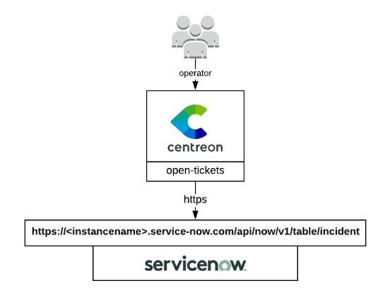

# Service Now Open ticket connector

## Table of contents
1. [How it works] (#how-it-works)
2. [Compatibility] (#compatibility)
3. [Requirements] (#requirements)
4. [Possibilities] (#possibilities)

## How it works 
Servicenow open-tickets provider uses the Servicenow REST API to get configuration data and open incidents about your monitoring alerts.
Since it gathers a lot of configurations objects from Itop, it puts them in cache. Loging out or waiting 10 hours will flush the cache.

## Compatibility 
This integration is (at least) compatible with the following Service Now versions:

- Madrid
- London
- New York

## Requirements
Before going any further, make sure that you correctly setup [centreon-open-ticket](https://documentation.centreon.com/docs/centreon-open-tickets/en/latest/installation/index.html)
into your Centreon instance

Our provider requires the following parameters:

| Parameter | Example of value |
| --------- | ---------------- |
| Instance Name | MyCompany |
| OAuth Clien ID |  |
| Username | admin |
| Password | itop |
| Protocol | https |
| Timeout | 60 |

## Possibilities 
As of now, the provider is able to retrieve the following objects from Itop:

- Categories
- Subcategories
- Impact
- Urgency
- Severity
- Assignment Group
- Assignment
