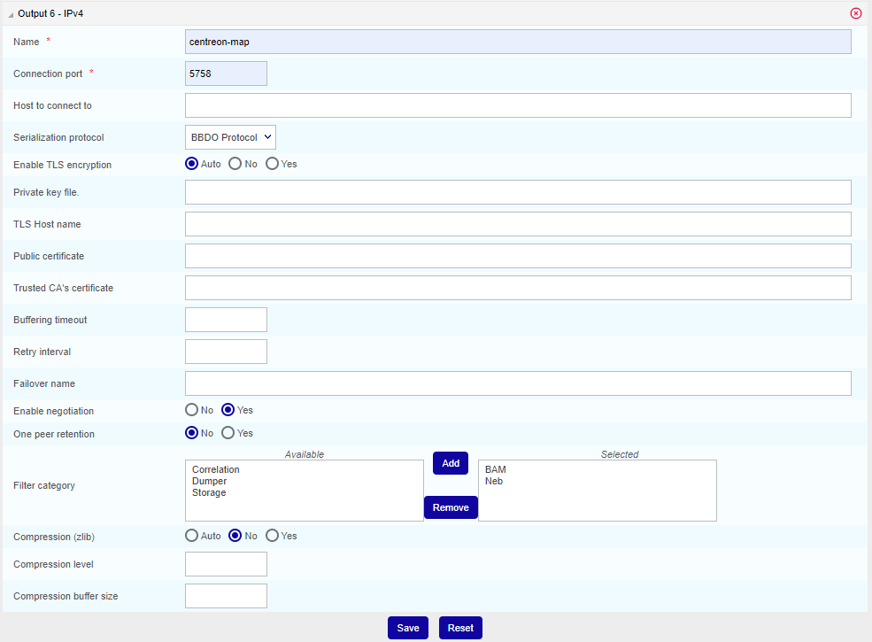

## Installation of Centreon MAP for a Centreon Remote Server

Installation of **Centreon MAP** extension on a **Centreon
Remote Server** has to be done exactly like the installation on a
Central server, only configuration and uninstallation are different.

If your Centreon Remote Server has not been installed yet, please refer to
the following
[documentation](https://documentation.centreon.com/docs/centreon/en/latest/administration_guide/poller/install_remote_server).

Then refer to the [installation procedure](install.md) to install
the 2 mains components:

- The web interface
- The server

After that, you'll have to do extra steps, explained below, to finish
Centreon Map installation for your Centreon Remote Server.

## Images synchronisation

Add access to the images synchronisation page **Administration  >  Parameters  >  Images**
```shell
[root@remote ~]# mysql centreon
MariaDB [centreon]> update topology SET topology_show='1' where topology_name='Images' ;
```

## Centreon Broker configuration

Configuration of **Centreon MAP** for a Centreon Remote Server consists
in creating configuration for Centreon Broker of the Centreon Remote
Server **from** the Central server so that, with a dedicated Centreon
Broker output on the Centreon Remote Server, Centreon Map can receive
real time data directly from its Centreon Remote Server.

To do so, you need to modify the **Centreon Broker Master**
configuration of the **Centeon Remote poller**. Go to
`Configuration > Pollers > Broker configuration` menu and edit the
remote poller configuration.

In the Output tab, create a new output with the following parameters:



To finish the installation, generate, export the configuration and
**restart** Centreon Broker manually.

## Uninstalling Centreon MAP

On a remote poller, you can uninstall **Centreon MAP** module the same
way as on the Centreon server central. All **Centreon Broker**
configuration for the Centreon Remote Server linked to the **Centreon
MAP** module have to be manualy removed. Look at the chapter above to
now what output you need to delete for your Centreon Remote Server(s)
